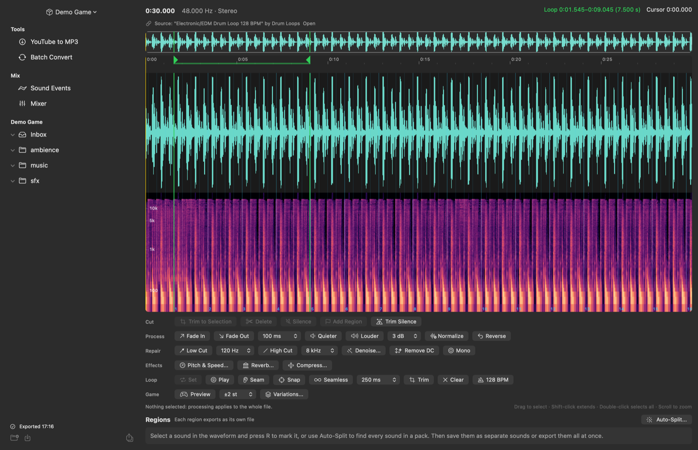
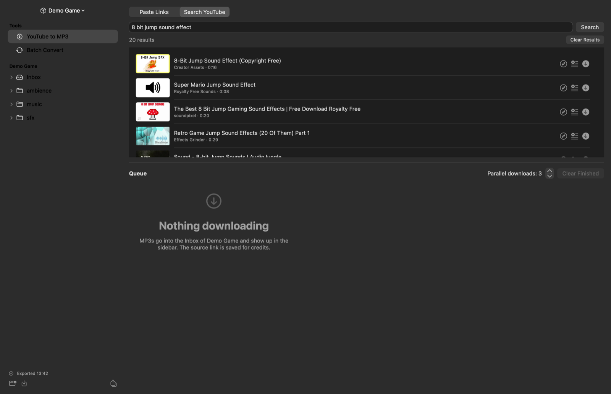
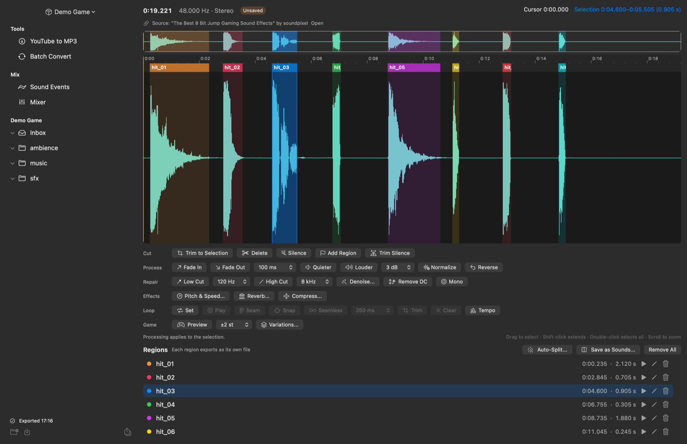
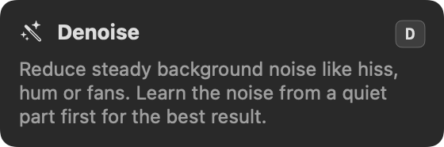
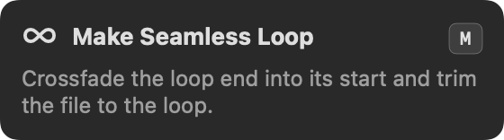
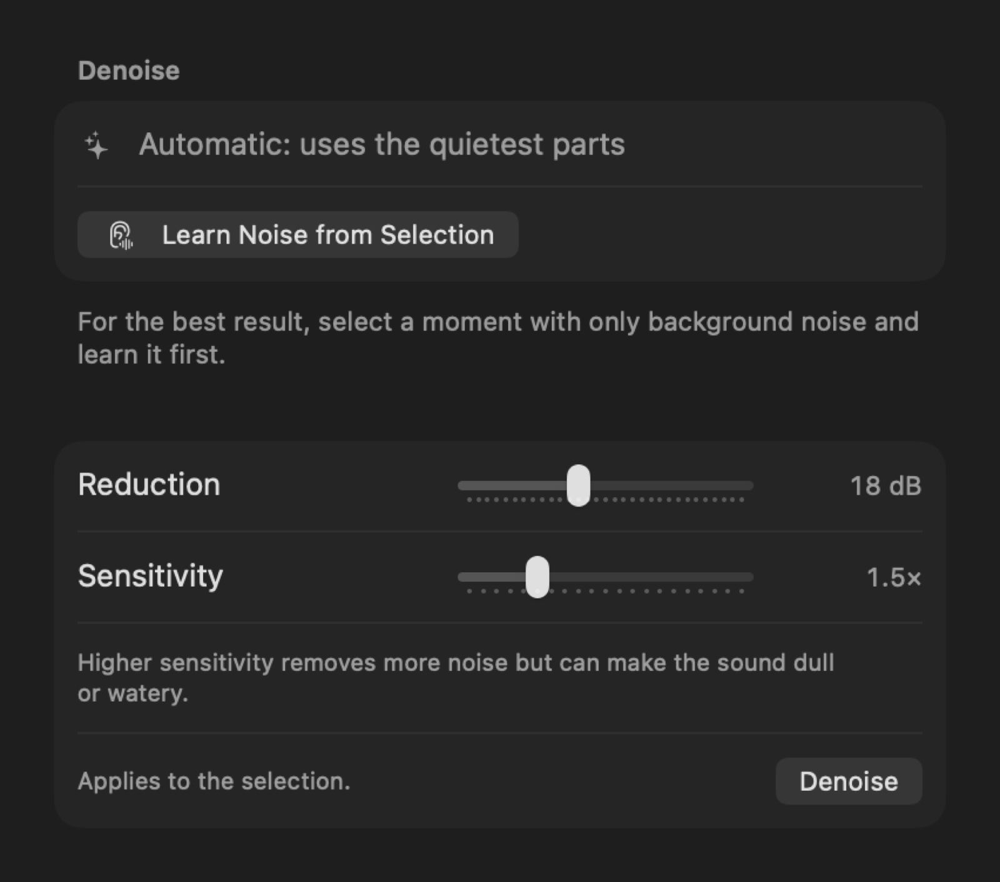
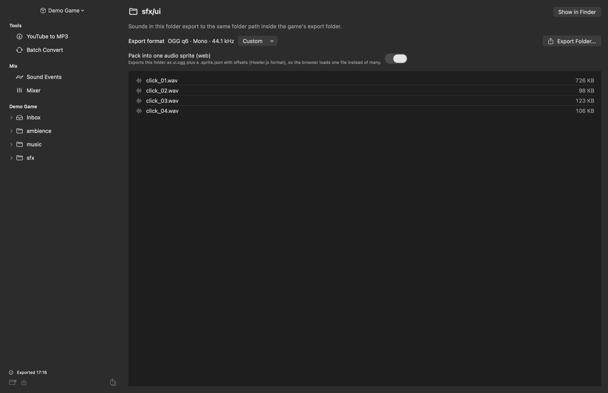
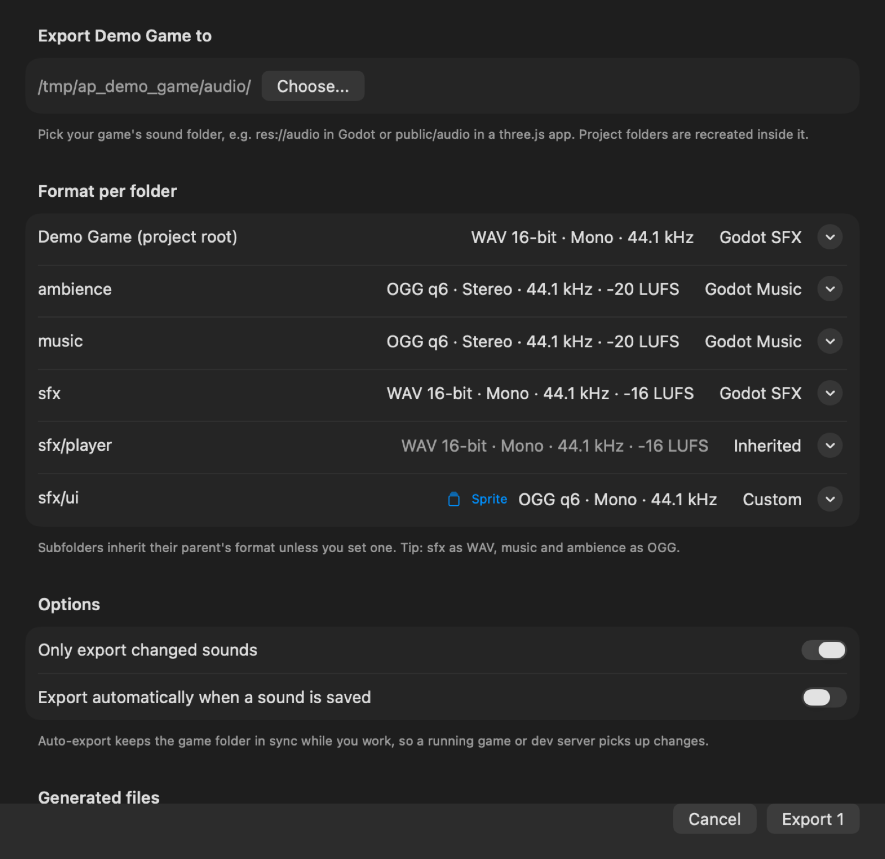
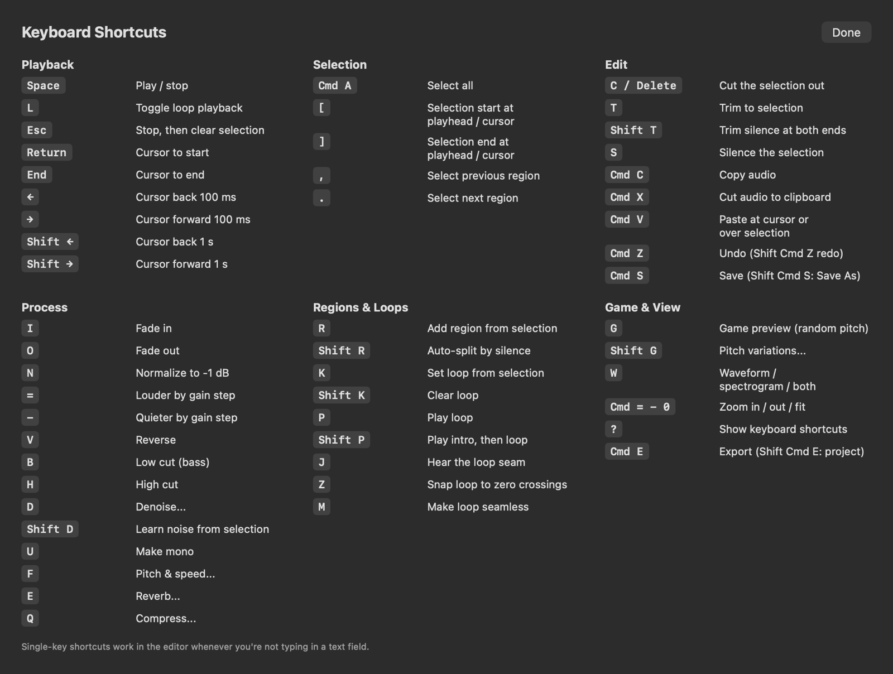

# Game Audio Asset Manager

A native macOS app that takes game audio from "I found a sound on YouTube" to "it's in the game, looped, loudness-matched and typed in code". It is built for a Godot and three.js pipeline and runs entirely on your Mac.



## Why this exists

Our game audio workflow used to span five tools: a YouTube downloader, an audio editor, a batch converter, a folder of loose files, and hand-written code that referenced sound paths. Every new sound meant repeating the same steps: download, cut, normalize, convert, rename to `snake_case`, copy into the game, and fix the loop in Godot's import dock.

Game Audio Asset Manager handles the whole trip in one place:

1. **Find**: search YouTube in the app, or paste a batch of links. You can download only the part you need, for example `1:30-2:05`.
2. **Clean**: trim, fade, normalize, denoise, cut rumble and hiss, remove DC, make mono.
3. **Cut**: auto-split a sound pack into single sounds, or mark regions by hand.
4. **Loop**: set loop points, snap them to zero crossings, crossfade the seam, and make music loops a whole number of bars.
5. **Organize**: one project per game. Folders mirror the game's sound folders, and every sound remembers where it came from.
6. **Export**: one click converts every sound into the game folder with the right format and loudness for its folder. It also writes a manifest, credits, and typed code for Godot and three.js.

## How it was built

It started as **Audio Prepare**, a small clip editor, and was built in a series of short sessions with an AI coding agent (Claude Code), starting from one sentence: *"a simple audio clip editor to cut files for game assets, plus a YouTube to MP3 downloader for 20 links at a time"*. Each round started from what was missing in real use:

| Round | What was added |
| --- | --- |
| 1 | SwiftUI app, batch YouTube to MP3 via `yt-dlp`, waveform editor, export presets for Godot and three.js |
| 2 | Per-game projects, loop points written into the WAV `smpl` chunk (Godot reads them), project export that mirrors folders, batch convert, YouTube search and time ranges, source tracking for credits |
| 3 | Low and high cut filters, auto-split by silence, random-pitch game preview, pitch variations, loudness matching per folder (EBU R128) |
| 4 | Single-key shortcuts for everything, spectrogram, tempo detection with a beat grid and bar-length loops |
| 5 | Crash guards for audio devices, unit tests and CI, generated `sounds.gd` and `sounds.ts`, variation groups, audio sprites, auto-export on save |
| 6 | Performance: selection dragging went from ~400 ms to ~5 ms per mouse move (details below), and playback now streams |
| 7 | Denoise, pitch and speed, reverb, compressor, hover cards that explain every tool |

Every feature was checked against something measurable before it was committed:

- Filters were measured at exactly -3 dB at the cutoff.
- Tempo detection was run on real 128 BPM drum loops.
- Loudness matching lands within 0.5 LU of its target.
- Generated GDScript was loaded in a headless Godot 4.
- Generated TypeScript was type-checked with `tsc --strict`.
- Streamed playback was rendered offline and compared with the source sample by sample.

## Features

### Download



- **Search YouTube** without leaving the app. Download a result directly, or add it to the link list so you can set a time range first.
- **Paste links**, one per line. Add a time range after a link to download only that part: `https://youtu.be/abc 1:30-2:05`.
- Downloads run in parallel and land in the project's Inbox. The source URL, title and channel are saved with each sound and end up in `CREDITS.md`. Check each source's license before shipping.

### Edit



| Row | Tools |
| --- | --- |
| Cut | Trim to selection, delete, silence, add region, trim silence |
| Process | Fades, gain, normalize, reverse |
| Repair | Low cut, high cut, **denoise** (learn the noise or detect it automatically), remove DC, mono |
| Effects | **Pitch & speed** (independent or tape), **reverb** (rooms, halls, plate, cathedral), **compress** (gentle, punchy, limiter) |
| Loop | Set, play, hear the seam, snap to zero, make seamless, trim, tempo |
| Game | Random-pitch preview, pitch variations |

- **Auto-split** finds every sound in a pack by the silence between them.
- **View** switches between waveform, spectrogram, or both (W).
- **Clipboard**: copy, cut and paste audio, also between files.
- **Undo** covers everything, and edits keep regions, loop points and tempo in place.

Hover over a tool for a moment to see what it does and its shortcut:

<p>
  
  
</p>



### Loops and music

- Select what should repeat and press **K**. Drag the green handles in the ruler to adjust.
- **Seam** plays the end of the loop into its start. **Snap** moves the loop points to zero crossings. **Seamless** crossfades the end into the start.
- **Tempo** detects BPM and the downbeat, draws bar numbers, and makes loops a whole number of bars.

### Organize

Each game gets a project in `~/Music/Game Audio Asset Manager/projects/<Name>/`. Libraries created under the old name stay in `~/Music/AudioPrepare`.

```
<Name>/
  Inbox/                        raw downloads and imports (never exported)
  sfx/player/jump_01.wav        your folders, mirrored on export
  music/drum_loop.wav
  .game-audio-asset-manager/project.json    loops, regions, tempo, sources, folder formats
```



### Export



- **Export Project** (Shift Cmd E) mirrors your folders into the game folder. Each folder has a format and a loudness target, and subfolders inherit them.
- Only changed sounds are re-exported. **Auto-export** updates the game folder every time you save, so a running game or dev server picks up changes.
- **Audio sprites** pack a folder into one file plus a Howler.js-style offset table, so the browser loads one file instead of dozens.
- **Loudness matching** measures each sound (EBU R128) and applies one fixed gain, capped at -1 dBTP, so dynamics stay intact.

Generated files in the export folder:

| File | For |
| --- | --- |
| `audio_manifest.json` | Every sound with file, duration, loop points, BPM, sprite offset, plus variation groups |
| `sounds.gd` | Godot `Sounds` class: preloaded streams, `Sounds.random("sfx/player/jump")`, OGG loop settings |
| `sounds.ts` | three.js: typed `SoundKey`, groups, `pickVariant()` |
| `CREDITS.md` | Sources for attribution |

## Using the sounds in a game

**Godot 4.** WAV loops are read automatically from the `smpl` chunk. OGG and MP3 files are cut at the loop end, and `sounds.gd` sets `loop_offset`:

```gdscript
$Player/Jump.stream = Sounds.random("sfx/player/jump")   # one of jump_01..03
$Player/Jump.play()
$Music.stream = Sounds.MUSIC_DRUM_LOOP                   # loops from 1.545 s, set by Sounds
```

**three.js.** Sound keys are typed, so a typo fails to compile:

```ts
import { sounds, pickVariant } from './audio/sounds';

const info = sounds[pickVariant('sfx/player/jump')];
new THREE.AudioLoader().load('/audio/' + info.url, (buffer) => {
  sound.setBuffer(buffer);
  sound.setLoop(info.loop);
  sound.play();
});
```

MP3 adds a few milliseconds of silence at both ends, so use OGG or WAV for loops.

## Shortcuts



Press **?** in the editor, or use Help > Keyboard Shortcuts (Cmd /). Single keys are ignored while you type in a text field.

## How it works

- **SwiftUI** for the app. The waveform is an AppKit view drawn outside SwiftUI's update cycle, with two layers:
  - a cached **base layer** (waveform, spectrogram, ruler, beat grid) that redraws only when the audio or zoom changes;
  - a thin **overlay** (selection, regions, loop, cursor, playhead) that redraws on every mouse move.
- **Performance fix.** Dragging a selection used to trigger a SwiftUI relayout of the whole window, about 400 ms per mouse move on a 5-minute file. Now the waveform observes the model directly with `withObservationTracking`, and the button rows use a flow layout that measures each button once. The result is under 10 ms per event.
- **AVFoundation** for decoding and playback. Playback streams in 2-second chunks, so starting or seeking never copies the whole file.
- **Accelerate / vDSP** for filters, the spectrogram, the denoiser (spectral subtraction with smoothed gains), tempo detection (spectral flux and autocorrelation), and peak analysis.
- **ffmpeg** for encoding, resampling and loudness measurement. **yt-dlp** for downloads.

## Setup

```sh
brew install yt-dlp ffmpeg xcodegen
make run       # generate the Xcode project, build Release, launch
make test      # run the unit tests
make install   # copy to /Applications
```

If YouTube downloads start failing, update yt-dlp: `brew upgrade yt-dlp`.

## Roadmap

Next, the app grows from a sound editor into a manager for all of a game's audio: sound events, mixing buses, environments, consistency checks and adaptive music. See [docs/ROADMAP.md](docs/ROADMAP.md).
